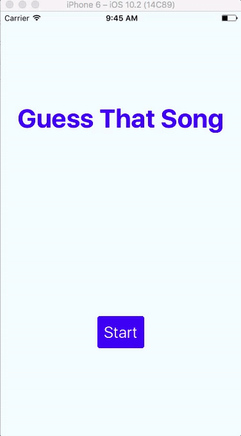

# React Native Navigation Exercise

### Guess That Song

To practice navigation, we're going to implement an app in which you have to guess a song that's playing.  The app will tell you if you're right or wrong.  Here is a gif of the app:




You can't hear it here, but the screen with the `TextInput` plays an audio file of a song.  You must guess the song!

### Getting Song Metadata

You will use the itunes affiliate api to get the song data.  The request you'll want to make is:

```
GET https://itunes.apple.com/us/lookup?id=<SONG_ID>
```

You can use this javascript class to get a random song id:

```js
export default class SongData {
  static randomSongId() {
    const songIds = ["995535015", "966411602", "823593456", "956689796", "943946671",
                     "982388023", "907242704", "201281527", "656801339", "910038357",
                     "250038575", "878000348",  "794095205",  "1645339",  "400835962",
                     "325618",  "169003415",  "51958108", "192688540", "684811768",
                     "344799464", "217633921", "192811017", "71068886", "640047583",
                     "517438248", "656479859", "310237", "991390352",  "344799727",
                     "162337613", "121695005", "159293848", "305118379",
                     "1193701392" ];

    const id = Math.floor(Math.random() * songIds.length);
    return songIds[id]; 
  }
}
```

### Playing The Audio

To play the audio, you'll need to use 2 components:

* [react-native-fs](https://github.com/johanneslumpe/react-native-fs)
* [react-native-sound](https://github.com/zmxv/react-native-sound)


To install them both:

```
npm install --save react-native-fs react-native-sound
react-native link
```